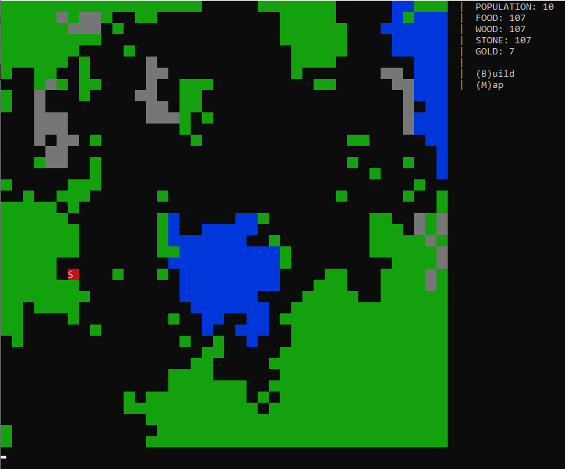

# Kingdom RTS Game



## Synopsis
This is the foundation for an RTS game. A single Race, two Biome types, and building mechanics have been implemented. 
This is the starting point to add in multiplayer, interactions, and game mechanics. 

## Motivation
After playing different RTS and 4X games, I wanted a (multiplayer) RTS game that did not devolve into combat only.
The aim of this game is to have player interaction without combat interactions.

## How to Run
Run Game.java. A menu with options is showed in the side. Enter the character or number then hit enter. The screen updates
every second so your input may appear to disappear. Input is not case-sensitive. 


## Code Example
While a little messy, this simple recursive function creates quick and interesting biomes.
```
   private void recursiveTileGrow(final Tile tile, int row, int col, int count) {
        if (count < 0) {
            return;
        }
        // randomize which direction we are moving way from row,col
        int colOffset = rnd.nextInt(4);
        if (colOffset == 3) colOffset = 1; // 50% for 0. 50% for -1,1
        else if (colOffset == 2) colOffset = -1;
        else colOffset = 0;

        int rowOffset = 0;
        if (colOffset == 0) {
            // dont let rowOffset also be 0
            rowOffset = rnd.nextInt(2);
            if (rowOffset == 0) rowOffset = -1;
        }
        else {
            rowOffset = rnd.nextInt(4);
            if (rowOffset == 3) rowOffset = 1; // 50% for 0. 50% for -1,1
            else if (rowOffset == 2) rowOffset = -1;
            else rowOffset = 0;
        }

        col += colOffset;
        row += rowOffset;

        if (row >= 0 && col >= 0 && row < tiles.length && col < tiles[row].length) {
            if (tiles[row][col] == tile) {
                // if there is a tree already, go back and try again
                recursiveTileGrow(tile,row - rowOffset, col - colOffset, count - 2);
            }
            else {
                tiles[row][col] = tile;
                recursiveTileGrow(tile,row - rowOffset, col - colOffset, count - 2);
                recursiveTileGrow(tile, row, col, count - 1);
            }
        }
        else {
            recursiveTileGrow(tile, row - rowOffset, col - colOffset, count - 1);
        }

    }
```
